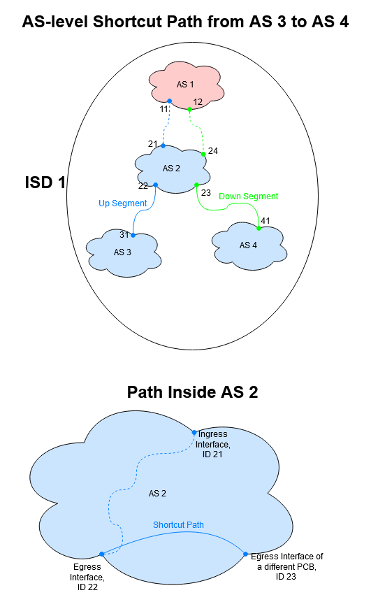
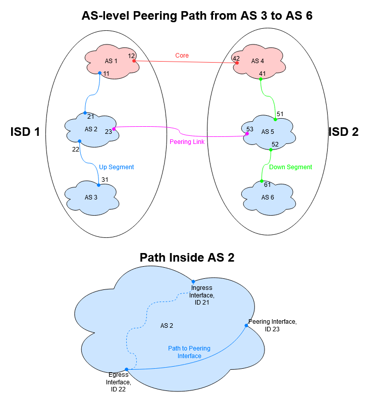
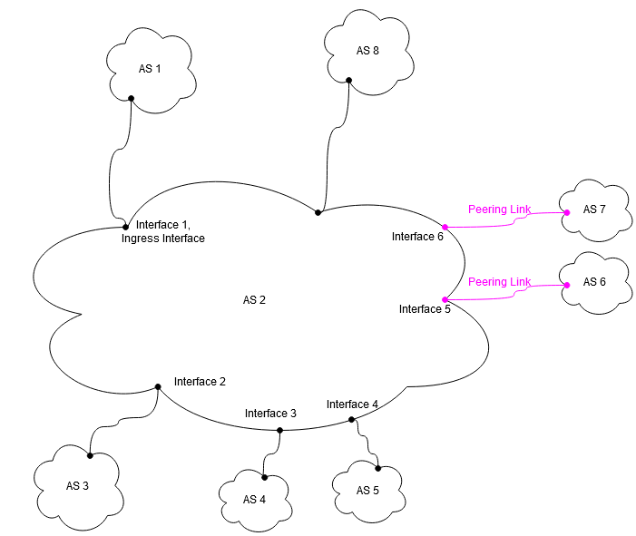
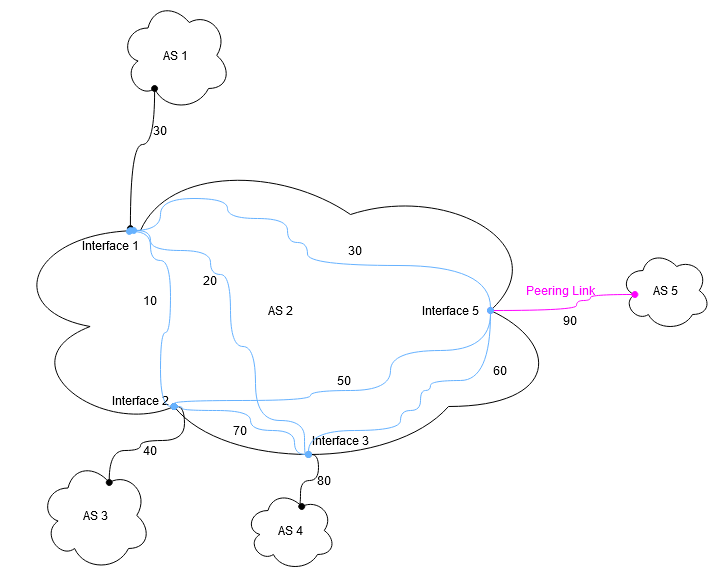

# Embedding Static Information in SCION Path Construction Beacons

This document describes how static information can be included in the
Path Construction Beacons (PCBs) in order to assist in the path
selection process. It first defines
what static metrics are, and gives a basic outline of how they can be
embedded in the PCBs. Then it provides a method of combining the fragments
of information included in the individual AS Entries into values that
describe the full end-to-end path.
Next it will describe each individual property to be included in detail,
as well as giving an overview of the information that needs to be provided
by an AS to make this functionality possible.
It concludes by laying out a proposal for an interface that will make
this information accessible to users and how this could be improved beyond
the scope of this project.

## Table of Contents

- [Overview and Motivation](#overview-and-motivation)
- [Combining Static Inter- and Intra-AS Metrics to End-to-End Metrics](#combining-static-inter-and-intra-as-metrics-to-end-to-end-metrics)
- [Definitions of Metric Extensions](#definitions-of-metric-extensions)
  - [Latency Information](#latency-information)
  - [Geographic Information](#geographic-information)
  - [Link Type](#link-type)
  - [Maximum Bandwidth](#maximum-bandwidth)
  - [Number of Internal Hops](#number-of-internal-hops)
  - [Generic Note](#generic-note)
  - [Overall Format](#overall-format)
- [Configuration File Format](#configuration-file-format)
- [Security and Accuracy of Information](#security-and-accuracy-of-information)
- [Application Programming Interface](#application-programming-interface)
- [User Interface](#user-interface)

## Overview and Motivation

When trying to find optimal end-to-end paths in the SCION network, it is often
useful to look at the properties of such paths in order to separate suitable paths
from undesirable ones. 
These properties can be divided
into 2 distinct categories: Static and Dynamic. Static properties refer to
attributes of a path that remain unchanged over the course of its entire lifetime.
Dynamic properties on the other hand can change from moment to moment. 
We illustrate the difference between the two using the example of bandwidth.
A static property of an end to end path would for example be the minimum
of the maximal bandwidths of all links along the path, i.e. the bandwidth
bottleneck.
A dynamic property would be the ephemeral bandwidth, i.e. the bandwidth
that is actually available to a connection at any given moment.
While dynamic properties need to be measured, static properties are known a priori
and can therefore be included upfront. 
In order to apply the above definition of static properties to SCION paths, the
following assumptions need to be made:

- The control service, which is responsible for adding all this metadata, has
  reliable information about the infrastructure (such as the border routers
  and the interfaces attached to them).
- The AS topology remains stable throughout the lifetime of a path segment.


Static information itself can be subdivided into two principal categories,
inter- and intra-AS metrics. The diagram below illustrates the difference
between them:


In order to be able to calculate e.g. the end-to-end
propagation delay of a path starting in AS 2 and ending in AS 3, we need
both the delay inside each AS (intra-AS), as well as the delay on the
connections between ASes (inter-AS).

#### Intra-AS Metrics

When measuring intra-AS metrics,
the egress interface is the "target" interface, to which the metric is
measured from every other interface. Only having the
metric between the ingress and egress interface is not sufficient
(see [Combining Static Inter- and Intra-AS Metrics to End-to-End Metrics]).

#### Inter-AS Metrics

The AS Entry is extended with metrics describing the outgoing connection (i.e. the 
child link). Looking at the figure
above, this means that AS 1 extends its AS Entry with information about its child link
from interface 2 to 3 before propagating it to AS 2.
This assures that the PCB always carries information about the entire path
it has traversed so far. Using this method, end-to-end metrics can be calculated
by simply combining intra- and inter-AS metrics.

## Combining Static Inter- and Intra-AS Metrics to End-to-End Metrics

Information about static properties is stored inside the PCBs. This is
achieved by each AS embedding information about itself in an extension field
of its ASEntry. Each such extension contains a small amount of metdata
describing a section of the path. In order to obtain static properties of
the end-to-end path, the relevant data in each of these extension entries is
extracted from the PCBs and combined to deliver the actual information.

### Segments

As the structure of an AS Entry is identical for up- and down segments,
both of them are extended in the same way.
AS Entries in core segments are treated slightly differently in that all
entries related to peering and shortcuts are omitted (see individual properties
for details).

Since each AS Entry carries information about one AS on the path, the different
segments of a path can be combined as follows: 

- Create an initially empty list of extension entries.
- Look at each segment in order.
- Extract the extension information from each AS Entry of the current segment
  and add it to the list.
- The resulting list of extension entries contains all the information
  necessary to calculate metrics for the end-to-end path.

There are three different types of paths: Normal Paths, Shortcut Paths, and 
Peering Paths. In order to be able to deal with all of them, different
methods of embedding and combining data need to be employed.

### Normal Path


In the case of a "normal" path without shortcuts or peering links, the
interfaces where traffic enters and leaves correspond to the ingress and
egress interfaces saved in the AS Entry of the PCB. The terms ingress and
egress interface refer to the way these interfaces would be encoded in the
PCB during the beaconing process.
Therefore the lower interface is always labelled as the egress interface, even when it is in
the up segment and would thus technically be the interface on which traffic enters the AS.
Calculating end-to-end metrics can therefore be done by simply adding up the intra-AS
metrics (from ingress to egress interface) as well as the inter-AS metrics (from egress
interface to the next AS on the path) for every AS on the end to end path.

In order to deal with such a normal path, we will always include ingress to egress metrics
in the PCB.

### Shortcuts



In the diagram above, traffic will enter AS 2 via interface 22.
Traffic will leave AS 2 via interface 23. Information about the
metrics of the child link attached to interface 22 is included in the up segment.
Metrics describing the intra-AS connection between interface 22 and 23 are also
included in the up segment, in the AS Entry of AS 2. Metrics describing the
child link attached to interface 23 are included in the down segment.
Thus the total of all extensions of the path segments contains information about
both the inter-AS connection between AS 3 and AS 2, and the inter-AS connection
between AS 2 and AS 4.

To deal with shortcut connections it is therefore necessary to include the following
2 things:

- The intra-AS metrics from the egress interface to every other interface in the AS.
- The inter-AS metrics of the child link.

Assuming that intra-AS metrics are symmetric, there will be redundant information
in the data described above when combining two path segments for a shortcut. We
can exploit this symmetry to reduce the amount of data we need to include in the PCBs
in total. The following example illustrates this idea.

In the PCB sent to AS 3,
the metric between interface 22 (the egress interface for this PCB) and interface 23
is saved. Since the metric between
interfaces 22 and 23, and that between 23 and 22 is assumed to be identical,
the metric between interface 23 and 22 can be omitted in the PCB that is sent to AS 4.

In a broader context, this allows us to reduce the data we include as follows:
Let i be the egress interface and j be any other interface that could be used in a
shortcut path. Then the metrics between interfaces i and j are included
if and only if the interface ID of j is larger than that of i, i.e. id(j)>id(i).

### Peering Links



As the figure shows, peering interfaces may differ from the egress interface encoded
in the AS Entry. Therefore, in addition to the list above, we also need to store the
inter-AS metrics for every connection attached to a peering interface of the AS in
the extension.

### Metrics Summary

To summarize what all of these considerations mean for the data being included in the
beacons, we will make an example using the diagram below.



Assume a PCB is sent out by AS 1 and arrives in AS 2 on interface 1. AS 2 now
propagates the PCB to two of its child ASes, AS 3 and AS 5. Let's first look at the
PCB sent out to AS 3. The egress interface in AS 2 is interface 2. Therefore, the
following information is included: 

- Ingress to egress metrics
  - Intf1 to Intf2
- Peering metrics
  - Intf2 to Intf5
  - Intf2 to Intf6
- Shortcut metrics
  - Intf2 to Intf3
  - Intf2 to Intf4

Now let's look at the PCB sent out to AS 5. The egress interface is interface 4: 

- Ingress to egress metrics
  - Intf1 to Intf4
- Peering metrics
  - Intf4 to Intf5
  - Intf4 to Intf6
- Shortcut metrics
  - None

Here the metrics between interface 4 and interfaces 2/3 can be omitted, since their
symmetric counterparts (Intf2/3 to Intf4) are already included in the beacons sent out
over the respective links.

## Definitions of Metric Extensions

### Latency Information

Latency Information refers to the total propagation delay on an end to end
path, comprised of intra- and inter-AS delays and measured on the scale of
milliseconds.
Use cases of such information include:

- Allows to augment path selection policy in order to obtain low latency paths.

#### Conceptual Implementation Latency

The latency information will be comprised of four main parts:

- The inter-AS latency of the child link between the egress interface and
  the ingress interface of the AS the PCB will be propagated to.
- The intra-AS latency between the ingress and egress interface of the PCB.
- A variable number of child latency pairs.
- A variable number of peering latency triplets.

There is one child latency pair for every interface attached to a child link. Each
such pair contains an interface ID and the latency in ms of the intra-AS connection
from the egress interface to that interface.

Peering latency triplets are very similar. There is one of them for each peering
interface, and each triplet contains the ID of the peering interface and the
intra-AS latency in ms from the egress interface to the peering interface.
Additionally, each triplet also contains the latency in ms of the peering
link attached to the peering interface.

In core segments, both child pairs and peering triplets are omitted, since there
can be no peering or shortcut paths in such segments.

#### Concrete Format Latency

The format for latency information, specified in terms of its capnp encoding, looks like this:

```CAPNP
struct LatencyInfo {
  childLatencies @0 :List(LCPair);
  peeringLatencies @1 :List(LPTriplet);
  egressLatency @2 :UInt16;
  ingressToEgressLatency @3 :UInt16;

  struct LCPair {
     intraDelay @0 :UInt16;
     interface @1 :UInt16;
  }

  struct LPTriplet {
     intraDelay @0 :UInt16;
     interDelay @1 :UInt16;
     interface @2 :UInt16;
  }
}
```

### Maximum Bandwidth

Maximum Bandwidth Information consists of 2 parts, Inter- and Intra-AS:

- Inter-AS Maximum Bandwidth Information describes the maximum bandwidth
  available on the inter-AS connections between each AS.
- Intra-AS Maximum Bandwidth Information describes the smallest maximum
  bandwidth available on any link that lies on the intra-AS routing path,
  i.e. the path from an interface to the egress interface.

Bandwidth is measured at the granularity of Kb/s.
Use cases of such information include:

- Allows to augment path selection policy, such that unsuitable paths can be
  excluded a priori.
- Avoid connections that are prone to congestion due to a low-bandwidth
  bottleneck somewhere.

#### Conceptual Implementation Maximum Bandwidth

The maximum bandwidth information will be comprised of 3 main parts:

- A variable number of maximum bandwidth pairs
- The bandwidth of the egress connection.
- The intra-AS maximum bandwidth between the ingress and egress interface
  of the PCB.

A maximum bandwidth pair consists of an interface ID and the intra-AS maximum bandwidth
between the egress interface and the interface with that ID. For peering interfaces,
the total maximum bandwidth is calculated as the minimum between the intra-AS bandwidth
and the bandwidth of the inter-AS peering link.

In core segments, the bandwidth pairs are omitted, since there
can be no peering or shortcut paths in such segments.

#### Concrete Format Maximum Bandwidth

The format for maximum bandwidth information, specified in terms of its capnp
encoding, looks like this:

```CAPNP
struct BandwidthInfo {
  bandwidthPairs @0 :List(BWPair);
  egressBW @1 :UInt32;
  ingressToEgressBW @2 :UInt32;

  struct BWPair {
     BW @0 :UInt32;
     interface @1 :UInt16;
  }
}
```

### Geographic Information

Geographic Information is the full set of GPS coordinates identifying the
location of every SCION border router deployed by an AS, as well as a real
life address associated with the location of each such SCION border router.
Use cases of such information include:

- Can be used to augment path selection policies in order to ensure paths do not
  leave a particular area, or alternatively ascertain that they never cross
  territory that is considered "undesirable" by the user.
- Can be used to provide users with information about the location of the entity
  they are communicating with (i.e. the endpoint on the other side of the path).
- Informing network admins about router locations.

#### Conceptual Implementation Geographic Information

The geographic information will be comprised of 1 main part:

- A variable number of locations.

A location serves to pool all interfaces which are located in the same
geographic location (i.e. within a certain range in terms of coordinates).
Each location is itself formed
of 2 main types of elements:

- A pair of GPS coordinates
  describing latitude and longitude of the location, as well as an address,
  in the format specified in RFC 4776 (found
  <a href = "https://tools.ietf.org/html/rfc4776#section-3.3"> here </a>)
  (1 value in total).
- The interface ID for every interface in the location (1 value per interface).

It is possible to use only the latititude and longitude pair, or the civic
address by simply omitting one of the two.


#### Concrete Format Geographic Information

The format for geographic information looks like this:

```CAPNP
struct GeoInfo {
  locations @0 :List(Location);

  struct Location {
     gpsData @0 :Coordinates;
     interfaces @1 :List(UInt16);

     struct Coordinates {
        latitude @0 :Float32;
        longitude @1 :Float32;
        address @2 :Data;
     }
  }
}
```

It should be noted that addresses (`address`) can be of variable length,
but are allowed to occupy a maximum of 500 bytes. Anything beyond that will
be discarded.

### Link Type

#### Definition Link Type

Link Type information gives a broad classification of the different protocols
being used on the links between two entities.
For now it distinguishes three different types of links:

- Links that go over the open internet.
- Direct links.
- Multihop links.

Use cases of such information include:

- Mitigating security concerns.
- Allowing users to select paths that e.g. avoid the open internet.

#### Conceptual Implementation Link Type

The Link type will be comprised of 2 parts:

- The link type for the inter-AS link attached to the egress interface.
- The inter-AS link type of all links attached to peering interfaces.

The latter is omitted in core segments.

#### Concrete Format Link Type

The format for the link type looks like this:

```CAPNP
struct LinkTypeInfo {
  peeringLinks @0 :List(PeeringPair);
  egressLinkType @1 :LinkType;

  enum LinkType{
     direct @0;
     multiHop @1;
     openNet @2;
  }

  struct PeeringPair {
     interface @0 :UInt16;
     peeringLinkType @1 :LinkType;
  }
}
```

### Number of Internal Hops

The Number of Internal Hops describes how many hops are on the Intra-AS path.
Use cases of such information include:

- Can be used to exclude undesireable paths from the selection.
- Obtain a selection of efficient, low latency paths (especially when combined
  with Latency Information).

#### Conceptual Implementation Number of Internal Hops

The number of internal hops will be comprised of 2 main parts:

- The number of internal hops between the ingress and egress interface of the
  PCB.
- A variable number of hoplength pairs.

A hoplength pair contains an interface ID and the number of
internal hops on the intra-AS path between the egress interface and the
interface associated with that ID.

#### Concrete Format Number of Internal Hops

The format for the number of internal hops looks like this:

```CAPNP
struct InternalHopsInfo {
  hopPairs @0 :List(HopPair);
  inToOutHops @1 :UInt8;

  struct HopPair {
     Hops @0 :UInt8;
     interface @1 :UInt16;
  }
}
```

### Note

A Note is simply a bit of plaintext.
Use cases of such information include:

- Tool for network engineers to communicate interesting/important information to
  their peers as well as users.

#### Conceptual Implementation Note

The Note subtype is comprised of 1 single element:

- A string.

#### Concrete Format Note

The format for the note can be seen below in the full extension format.

The length of `note` is variable, but capped at 2000 bytes. 

### Overall Format

The full wire format of the extension simply combines the capnp structs for each individual
property described above:

```CAPNP
struct StaticInfo {
   latency @0 :LatencyInfo;
   geo @1 :GeoInfo;
   linktype @2 :LinktypeInfo;
   bandwidth @3 :BandwidthInfo;
   internalHops @4 :InternalHopsInfo;
   note @5 :Text;
}
```

## Configuration File Format

In order for the extension to work, a configuration file needs to be provided to a
specific location [tbd]. This config file comes in the form of a JSON file, which
contains a list of all the properties.

Latency is represented by a map of key-value pairs, where the keys are the
interface IDs and the values look as follows:

Name             | Type  | Description |
-----------------|-------|-------------|
`Inter`          |Integer|Inter-AS latency from interface to AS on the other end of the link|
`Intra`          |Map of key-value pairs, the keys being the interface ID|Values: Intra-AS latency from egress interface to the interface the key refers to|

Bandwidth is represented by a map of key-value pairs, where the keys are the
interface IDs and the values look as follows:

Name             | Type  | Description |
-----------------|-------|-------------|
`Inter`          |Integer|Inter-AS bandwidth from interface to AS on the other end of the link|
`Intra`          |Map of key-value pairs, the keys being the interface ID|Values: Intra-AS bandwidth from egress interface to the interface the key refers to|

Geographical Information is represented by a map of key-value pairs, where the keys are the
interface IDs and the values look as follows:


Name             | Type  | Description |
-----------------|-------|-------------|
`Latitude`             |Decimal value|Longitude gps coordinates of interface `i`, i.e. the interface associated with the key|
`Longitude`             |Decimal value|Latitude gps coordinate of interface `i`|
`Address`        |String|Address of interface `i`|

Linktype is represented by a map of key-value pairs, where the keys are the
interface IDs and the values are the link type (in the form of a string)
of the inter-AS connection attached to that interface.

Internal hops is represented by a map of key-value pairs, where the keys are the
interface IDs and the values look as follows:

Name             | Type  | Description |
-----------------|-------|-------------|
`Intra`          |Map of key-value pairs, the keys being the interface ID|Values: Number of internal hops from egress interface to the interface the key refers to|

The note is simply represented as a string of arbitrary length.

Let us look at an AS with three interfaces with IDs 1, 2, 3 and 5 which looks like
the diagram below. The values attached to the connections represent the latency
between interfaces.



The config file for this AS would then look like this (actual
values are abitrary, "asdf" is used as a placeholder for longer strings):

```JSON
{
  "Latency": {
    "1":{
      "Inter": 30,
      "Intra": {
        "2": 10,
        "3": 20,
        "5": 30
      }
    },
    "2":{
      "Inter": 40,
      "Intra": {
        "1": 10,
        "3": 70,
        "5": 50
      }
    },
    "3":{
      "Inter": 80,
      "Intra": {
        "1": 20,
        "2": 70,
        "5": 60
      }
    },
    "5":{
      "Inter": 90,
      "Intra": {
        "1": 30,
        "2": 50,
        "3": 60
      }
    }
  },
  "Bandwidth": {
    "1":{
      "Inter": 400000000,
      "Intra": {
        "2": 100000000,
        "3": 200000000,
        "5": 300000000
      }
    },
    "2":{
      "Inter": 4000000000,
      "Intra": {
        "1": 5044444,
        "3": 6555555550,
        "5": 75555550
      }
    },
    "3":{
      "Inter": 80,
      "Intra": {
        "1": 9333330,
        "2": 10444440,
        "5": 133333310
      }
    },
    "5":{
      "Inter": 120,
      "Intra": {
        "1": 1333330,
        "2": 155555540,
        "3": 15666660
      }
    }
  },
  "Linktype": {
    "1":"direct",
    "2":"opennet",
    "3":"multihop",
    "5":"direct"
  },
  "Geo": {
    "1":{
      "Latitude": 47.2,
      "Longitude": 62.2,
      "Address": "geo1"
    },
    "2":{
      "Latitude": 79.2,
      "Longitude": 45.2,
      "Address": "geo2"
    },
    "3":{
      "Latitude": 47.22,
      "Longitude": 42.23,
      "Address": "geo3"
    },
    "5":{
      "Latitude": 48.2,
      "Longitude": 46.2,
      "Address": "geo5"
    }
  },
  "Hops": {
    "1":{
      "Intra": {
        "2": 2,
        "3": 3,
        "5": 0
      }
    },
    "2":{
      "Intra": {
        "1": 2,
        "3": 3,
        "5": 1
      }
    },
    "3":{
      "Intra": {
        "1": 4,
        "2": 6,
        "5": 3
      }
    },
    "5":{
      "Intra": {
        "1": 2,
        "2": 3,
        "3": 4
      }
    }
  },
  "Note": "asdf"
}
```

## Security and Accuracy of Information

The responsibility for providing all of this metadata lies with the individual
ASes. There is no mechanism to enforce that this information
is complete or accurate. Thus no correctness guarantees can be given
for the static information. 
This must be considered when trying to use static information for security purposes,
such as avoiding links that go over the open internet or not routing through certain
geographical areas.

We can however provide guarantees when it comes to integrity and accountability,
thanks to the fact that path segments are signed. This has 2 implications:

- No other AS can tamper with the information included by a certain AS.
- The source of information is visible and non-repudiable. Thus, if an AS was
  detected to be including false information, it can be held accountable by e.g.
  being added to a black list.

## Application Programming Interface

Applications that would like to make use of static information could do so by
configuring their path selection policies to consider them during the selection
process. This could be achieved by extending the path policy language.
Furthermore a clearly defined way how such a policy could be used by an
application (e.g. using another special json file to
configure this process) would need to be provided.
However, these considerations are beyond the scope of this document and not
further explored here.

## User Interface

### Command Line Interface

In order to make use of the information this extension provides, we will
create a command line interface (CLI) to extract data from the extension.
This CLI will be implemented as an extension of the current showpaths tool.
To display information about the static properties, showpaths can be
called with the flag `-staticinfo` and the following values will be displayed
(provided they are available):

Name               | Description |
-------------------|-------------|
EndToEndLatency | Minimal end to end propagation delay along the entire path|
Geo | Geographical location in terms of GPS coordinates of each AS on the path (achieved by displaying the geographical locations of all interfaces of the AS)|
MaxBW | Bottleneck maximum bandwidth along the entire path|
InternalHops | The number of internal hops along the entire path|
Linktypes| The link type of each inter-AS connection along the entire path| 
Notes | The notes for each AS on the path|

### Other Frontends

There could be other ways of making this information available to users,
such as a GUI. While worth exploring in the future, such tools are beyond
the scope of this document.
